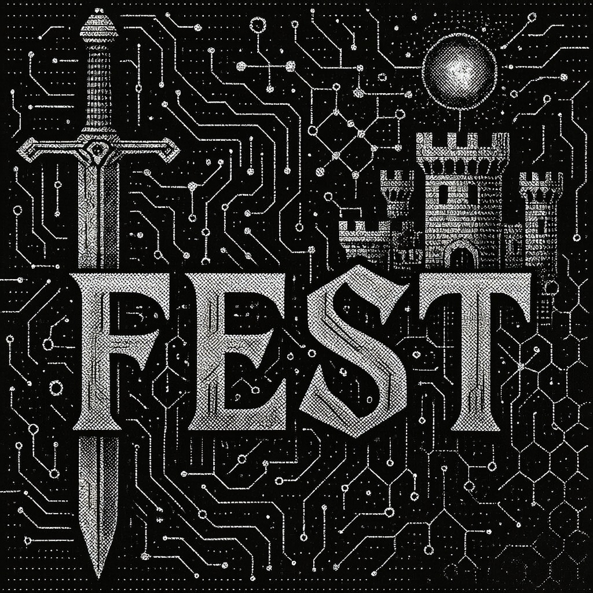

# Fest CLI



Fest is a CLI tool for working with **Festival Methodology** - a hierarchical agentic planning and execution system designed for AI agent workflows.

## What is Festival Methodology?

Festival Methodology is a structured approach to **hierarchical agentic planning and execution**. It organizes complex projects into a three-level hierarchy that AI agents can systematically work through:

```
Festival (the project)
├── Phase (major milestone)
│   ├── Sequence (related tasks)
│   │   ├── Task 1
│   │   ├── Task 2
│   │   └── Task 3
│   └── Sequence
└── Phase
```

**Why this structure?**

- **Context Management**: AI agents have limited context windows. Festivals break work into digestible chunks that fit within agent context limits.
- **Goal-Oriented**: Each level (festival, phase, sequence, task) has explicit goals. Agents always know what they're working toward.
- **Resumable**: Work can be paused and resumed. A new agent session can pick up exactly where the last one left off.
- **Traceable**: Every task links to its parent sequence and phase. Progress is trackable across the entire project.
- **Just-in-Time Context**: Agents only load the context they need for the current task, minimizing token usage while maintaining full awareness of the project structure.

**Key Concepts:**

- **Festival**: A complete project or initiative with a defined outcome
- **Phase**: A major milestone (e.g., "Design", "Implementation", "Testing")
- **Sequence**: A group of related tasks that accomplish a specific goal
- **Task**: A markdown document containing a unit of work. Similar to a Claude Code plan - each task document contains multiple actions, acceptance criteria, and context. Tasks are not single to-dos; they're comprehensive work units that may include many steps.
- **Quality Gates**: Validation checkpoints at the end of sequences (testing, code review, etc.)

## What fest Does

Fest is both a **project scaffolding tool** and an **agent guidance system**. It teaches agents how to work with Festival Methodology and guides them through execution with minimal context overhead.

**Agent Guidance System:**

- Built-in documentation teaches agents the methodology on-demand (`fest intro`, `fest understand`)
- Agents learn what they need, when they need it - no upfront context dump
- `fest next` shows agents exactly what to work on next with full inline context
- Self-documenting commands guide agents through proper usage

**Project Management:**

- **Create**: Interactive TUI for scaffolding festivals, phases, sequences, and tasks
- **Validate**: Check festival structure for issues and auto-fix common problems
- **Navigate**: Quick commands to jump between festivals, phases, and sequences
- **Track**: Monitor completion status across all levels

## Installation

```bash
# Install from source
git clone https://github.com/Obedience-Corp/fest
cd fest
just install
```

Or with Go:

```bash
go install github.com/Obedience-Corp/fest/cmd/fest@latest
```

## Shell Integration (Recommended)

Add to your shell config for quick navigation commands:

```bash
# Zsh/Bash
eval "$(fest shell-init zsh)"

# Fish
fest shell-init fish | source
```

This gives you:

- `fgo` - Quick navigation (`fest go`)
- `fls` - Quick listing (`fest list`)
- Tab completion for all fest commands

## Agent Workflow

The typical workflow for AI agents:

### 1. Learn the Methodology

```bash
fest intro                    # Start here - getting started guide
fest understand methodology   # Core principles
fest understand structure     # 3-level hierarchy
```

### 2. Initialize & Create

```bash
fest init                     # Initialize festivals directory
fest create festival          # Create a new festival (TUI)
fest create phase             # Add phases
fest create sequence          # Add sequences
```

### 3. Plan & Validate

```bash
fest validate                 # Check structure for issues
fest validate --fix           # Auto-fix common problems
fest status                   # View festival progress
```

### 4. Execute

```bash
fest next                     # Get next task with full context
fest progress                 # Track execution progress
```

## Quick Commands

After shell integration:

| Command | Full Form | Purpose |
|---------|-----------|---------|
| `fgo` | `fest go` | Toggle between linked festival and project directories |
| `fgo <name>` | `fest go <name>` | Navigate to a specific festival |
| `fgo 2` | `fest go 2` | Go to phase 002 |
| `fgo 2/1` | `fest go 2/1` | Go to phase 2, sequence 1 |
| `fgo active` | `fest go active` | Go to active festivals |
| `fls` | `fest list` | List festivals by status |
| `fls active` | `fest list active` | List active festivals |

**Smart Navigation**: `fgo` with no arguments toggles between a festival directory and its linked project directory (set up with `fest link`). This makes it easy to jump back and forth between planning and implementation.

## Command Reference

Fest has 40+ commands organized into 7 groups. Here's a summary — run `fest --help` for the full list with descriptions.

**Learning** — Learn the methodology before executing tasks
| Command | Purpose |
|---------|---------|
| `fest intro` | Getting started guide (run first!) |
| `fest understand` | Learn methodology concepts |
| `fest validate` | Check festival structure for issues |
| `fest wizard` | Interactive guidance for festival creation |
| `fest gates` | Manage quality gates at sequence boundaries |
| `fest markers` | Manage template markers in festival files |

**Creation** — Build festival structures
| Command | Purpose |
|---------|---------|
| `fest create` | Create festivals/phases/sequences/tasks (TUI) |
| `fest scaffold` | Generate festival structures from plans |
| `fest tui` | Interactive UI for festival creation and editing |
| `fest insert` | Insert new festival elements |
| `fest apply` | Apply a local template to a destination file |
| `fest templates` | Manage agent-created templates |
| `fest research` | Manage research phase documents |

**Structure** — Reorganize festival elements
| Command | Purpose |
|---------|---------|
| `fest remove` | Remove elements and renumber |
| `fest renumber` | Renumber festival elements |
| `fest reorder` | Reorder festival elements |

**Workflow** — Execute and track festival work
| Command | Purpose |
|---------|---------|
| `fest next` | Get next task with full inline context |
| `fest task` | Manage task status (complete, block, reset) |
| `fest progress` | Track execution progress |
| `fest commit` | Create git commit with task reference |
| `fest promote` | Promote festival to next lifecycle status |
| `fest workflow` | Manage workflow-based phase execution |
| `fest feedback` | Manage structured feedback collection |
| `fest ritual` | Manage repeatable ritual festivals |

**Query** — Inspect festival data
| Command | Purpose |
|---------|---------|
| `fest status` | Query festival entity statuses |
| `fest show` | Display festival information |
| `fest list` | List festivals by status |
| `fest context` | Get context for current location or task |
| `fest deps` | Show task dependencies |
| `fest commits` | Query commits by festival element |
| `fest parse` | Parse festival documents into structured output |
| `fest rules` | Display festival rules |
| `fest types` | Discover and explore template types |

**Navigation** — Move between festival elements
| Command | Purpose |
|---------|---------|
| `fest go` | Navigate to festivals directory |
| `fest explore` | Interactive hierarchy drilldown |
| `fest link` | Link festival to project directory |
| `fest links` | List all festival-project links |
| `fest unlink` | Remove festival-project link |

**System** — Configuration and maintenance
| Command | Purpose |
|---------|---------|
| `fest config` | Manage fest configuration |
| `fest init` | Initialize a new festival directory structure |
| `fest system` | Manage templates and tool configuration |
| `fest index` | Manage festival indices |
| `fest count` | Count tokens in files or directories |
| `fest migrate` | Migrate festival documents |
| `fest extension` | Manage methodology extensions |
| `fest completion` | Generate shell completion scripts |

See [docs/commands.md](docs/commands.md) for the full command reference.

## Configuration

Config stored at `~/.config/fest/config.json`. Run `fest config show` to view.

## Development

Uses `just` for all build/test commands:

```bash
just              # List all commands
just build        # Build fest binary
just test         # Testing commands (unit, integration, coverage)
just install      # Install to $GOBIN
just lint         # Format and vet
just clean        # Clean build artifacts
just docs         # Generate CLI reference docs
```

Subcommand modules:

```bash
just test         # Testing commands
just xbuild       # Cross-platform builds
just release      # Release packaging
just tags         # Git tag management
```

## Learn More

The CLI is self-documenting:

```bash
fest --help              # All commands with workflows
fest understand          # Methodology learning hub
fest [command] --help    # Detailed command help
```

## License

Business Source License 1.1 - See [LICENSE](LICENSE) for details.
