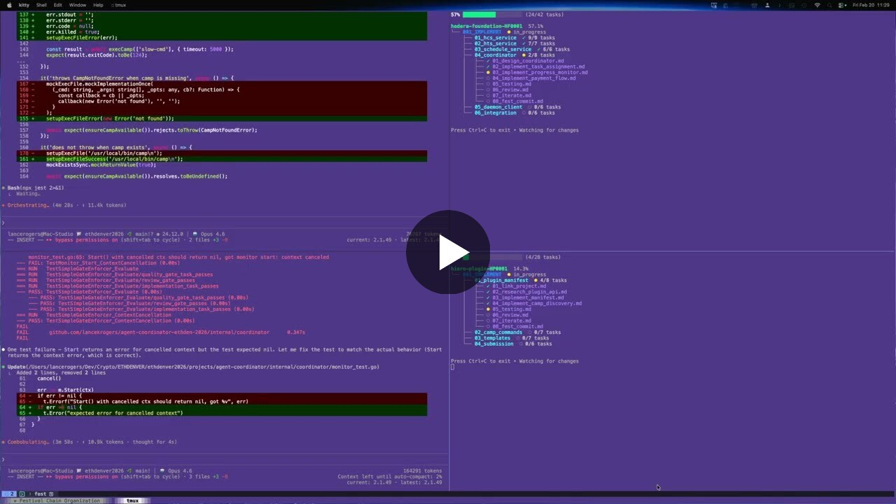

# Fest CLI

> **Part of [Festival](https://github.com/Obedience-Corp/festival)** - mission-based AI workspace management. Fest handles hierarchical planning and execution loops; [camp](https://github.com/Obedience-Corp/camp) handles workspace management. Together they give structure to how you work across multiple projects, contexts, and AI agents.

<p align="center">
  <a href="https://github.com/Obedience-Corp/fest/stargazers"></a>
</p>

<p align="center">
  
</p>

<p align="center">
  
</p>
<p align="center"><em><code>fest next</code> hands the agent its next task; <code>fest watch</code> shows the tree fill in as the work lands.</em></p>

<p align="center"><em><a href="https://github.com/Festival-Examples/example-camp-hardening-festival">Browse a complete festival end to end &rarr;</a></em></p>

**Fest is a template-driven agent orchestrator.** You describe work as structured documents scaffolded from templates you control, and agents execute them through a tracked loop: `fest next` hands the agent its next task with full context, quality gates and approval judges check the work, and progress lands in git. Festival Methodology transforms high-level objectives into structured, executable work that AI agents complete autonomously; fest is the CLI that makes it happen.

This practice is **loop engineering**: instead of babysitting prompts, you design the loop your agents run in (the goals, steps, gates, and feedback) and let them run it. The better your loop, the less you supervise. Fest is a tool for building those loops out of plain markdown.

**Install** (see the [festival repo](https://github.com/Obedience-Corp/festival#install) for all package options):

```bash
brew install --cask Obedience-Corp/tap/festival   # macOS/Linux (installs camp + fest)
npm install -g @obedience-corp/festival           # any platform with node
```

Festivals live within **camps** (previously called campaigns), isolated workspaces managed by [camp](https://github.com/Obedience-Corp/camp). A camp organizes your projects, plans, and context in one place. See the [methodology README](methodology/README.md) for the complete guide.

## Your Templates, Your Workflow

Fest ships with a complete default methodology, but the methodology is a
template set, not a requirement. Everything fest scaffolds comes from
templates you can inspect and change:

- **Camp-level templates** - every festival, phase, sequence, and task
  document is generated from `festivals/.festival/templates/` in your
  camp. Edit them and fest uses your versions.
- **Custom festival types** - `festivals/.festival/festival_types.yaml`
  defines which phases each festival type auto-scaffolds. Add your own types
  for your own workflow shapes.
- **Quality gates** - defaults included; replace or modify them camp-wide
  or per festival.
- **Lifecycle hooks** - declare named commands at machine / festivals / festival
  layers, bind them to steps, and inspect with `fest hooks list`. The approval
  judge is one hook (`approval_judge`); see [docs/concepts/hooks.md](docs/concepts/hooks.md).
- **Template syncing** - `fest system sync` pulls templates from a
  configurable repository (`repository.url`, `branch`, and `path` in
  [configuration](docs/configuration.md)), so a team can maintain and
  distribute its own template set.

If you can write markdown, you can make fest orchestrate agents your way.
The default templates encode one proven workflow; yours can encode yours.

## Steps, Not Time

Festival plans in **steps to completion**, not time estimates. AI agents work exponentially faster than humans and are improving faster than anyone can predict - a festival that takes a week today might take 10 minutes next month. Time-based estimation is meaningless in this context. What matters is the sequence of steps between where you are and where you need to be.

## When to Use a Festival

A festival scales to the work. It can be:

- A **complex feature** that spans multiple services and needs careful sequencing
- An **entire quarter's worth of epics** broken into phases with clear milestones
- All the **infrastructure for a new initiative** from zero to production
- A **massive refactor** that touches every layer of the stack

If you can describe the task in a single prompt and an agent can finish it in one session, you don't need a festival. If the work has dependencies, requires decisions, spans multiple sessions, or needs to follow specific patterns - that's what festivals are for.

## What Makes Festival Different

### Hierarchical Goal System

Every level has clear, measurable goals with built-in evaluation frameworks. **Festival goals** define overall success criteria. **Phase goals** set stage-specific objectives. **Sequence goals** ensure granular completion. You always know if you've succeeded.

### Context Preservation

`CONTEXT.md` captures key decisions, rationale, session handoff notes, and open questions. This maintains continuity across AI sessions and human reviews - no more losing context between conversations.

### Autonomy Levels

Every task is marked with an autonomy level - **high** (agent completes independently), **medium** (may need edge case clarification), or **low** (expect human collaboration). Agents know when to proceed and when to ask for help.

### Just-In-Time Documentation

Agents read templates and methodology docs only when needed, preserving context window for actual work. No upfront context dumps.

For the complete methodology guide, see [methodology/README.md](methodology/README.md).

## Three-Level Structure

Festival organizes work into **phases**, **sequences**, and **tasks** - each with its own goal document:

```text
Goal: Build E-Commerce Platform
├── FESTIVAL_GOAL.md                    # Overall success metrics
├── FESTIVAL_OVERVIEW.md                # Project description
├── fest.yaml                           # Configuration
│
├── 001_PLAN/ (type: planning)          # Uses WORKFLOW.md
│   ├── PHASE_GOAL.md
│   ├── WORKFLOW.md                     # Step-by-step planning guidance
│   ├── inputs/                         # Reference materials
│   ├── decisions/                      # Captured decisions
│   └── plan/                           # Resulting plans
│
├── 002_IMPLEMENT/ (type: implementation)  # Uses numbered sequences
│   ├── PHASE_GOAL.md
│   ├── 01_backend/
│   │   ├── SEQUENCE_GOAL.md
│   │   ├── 01_database_setup.md
│   │   ├── 02_api_endpoints.md
│   │   ├── 03_testing.md              # Quality gate
│   │   ├── 04_review.md               # Quality gate
│   │   └── 05_iterate.md              # Quality gate
│   └── 02_frontend/
│       ├── SEQUENCE_GOAL.md
│       ├── 01_components.md
│       ├── 02_state_management.md
│       ├── 03_testing.md              # Quality gate
│       ├── 04_review.md               # Quality gate
│       └── 05_iterate.md              # Quality gate
│
└── 003_VALIDATE/ (type: review)
    └── PHASE_GOAL.md
```

**Key distinction**: Planning phases use `WORKFLOW.md` for guided process. Implementation phases use numbered sequences with task files. This is the most important structural concept in Festival.

## Phase Types

Every phase has a **type** that determines its internal structure:

| Phase Type | Purpose | Structure | When to Use |
|-----------|---------|-----------|-------------|
| **planning** | Design, architecture, requirements | `WORKFLOW.md` + `inputs/` + `decisions/` + `plan/` | Breaking down goals into plans |
| **implementation** | Writing code, building features | Numbered sequences with task files | Executing defined work |
| **research** | Investigation, exploration, auditing | `WORKFLOW.md` + `sources/` + `findings/` | Exploring unknowns |
| **ingest** | Absorbing external content, data | `WORKFLOW.md` + `input_specs/` + `output_specs/` | Processing external inputs |
| **review** | Code review, testing, validation | Freeform with `PHASE_GOAL.md` | Verifying completed work |
| **non_coding_action** | Documentation, process changes | Freeform with `PHASE_GOAL.md` | Non-code deliverables |

Workflow phases (planning, research, ingest) use a `WORKFLOW.md` file with step-by-step guidance and checkpoints. Implementation phases use numbered sequences containing task files. This distinction shapes how agents navigate and execute work.

## Quality Gates

Every implementation sequence ends with built-in quality checks:

```text
01_feature_code.md
02_more_code.md
03_testing.md            # Run tests, verify functionality
04_review.md             # Code review checklist
05_iterate.md            # Address feedback, iterate
```

Defaults are included out of the box but fully customizable: modify them at the camp level via the `.festival/` directory, or override per-festival.

## What fest Does

**Agent Guidance System** - Built-in documentation teaches agents the methodology on-demand (`fest intro`, `fest understand`). `fest next` shows exactly what to work on next with layered context - festival, phase, and sequence goals plus complete task content. Agents learn what they need, when they need it.

**Planning and Execution Engine** - Scaffold festivals with interactive TUI (`fest create`). Validate structural compliance (`fest validate --fix`). Navigate between festivals, phases, and sequences (`fgo`). Track progress across all levels (`fest status`, `fest progress`). Execute with festival-aware git tracking (`fest commit`).

## Battle-Tested at Scale

Festival Methodology has been refined through **daily production use** spanning infrastructure, CLI tools, architecture, web launches, and multi-service platforms.

**Complexity tiers with real examples:**

| Tier | Phases | Example Festivals |
|------|--------|-------------------|
| **Focused** | 3-4 | fest-improvements, fls-command-implementation, camp-intent-enhancements |
| **Standard** | 5-6 | obey-daemon-implementation (6 phases, 28 sequences), camp-cli, fest-cli-agent-feedback |
| **Complex** | 7-9 | guild-scaffold (9 phases, 30 sequences), obediencecorp-website-launch |

These festivals span Go, Rust, Python, and web projects - from simple CLI fixes to building an entire daemon service with gRPC, WebSocket, and SQLite from scratch.

## Realistic Expectations

- Festival gets you **90% there autonomously** - AI agents handle the bulk of implementation
- **Human expertise guides the final 10%** - your insight ensures quality and correctness
- Goals evolve as you learn - multiple festivals may be needed as requirements clarify
- Best for **complex, multi-session projects** - not needed for single-task work

## Festival vs Other Approaches

| Aspect | Festival | Traditional PM | Ad-hoc AI |
|--------|----------|---------------|-----------|
| **Focus** | Goal achievement via tasks | Task tracking | Quick answers |
| **Task Detail** | Complete executable specs | User stories | Vague prompts |
| **Planning Model** | Steps to completion | Sprint cycles | One-shot prompts |
| **Context** | Persists in CONTEXT.md | Meeting notes | Lost between chats |
| **AI Autonomy** | Guided by autonomy levels | N/A | Constant prompting |
| **Collaboration** | Human-AI task creation | Human teams | Human directs |
| **Success Metrics** | Built-in evaluation framework | Retrospectives | Undefined |
| **Customization** | Template-driven; bring your own workflow | Process imposed by tool | None |

## Installation

fest ships bundled with camp as part of the [Festival packaging repo](https://github.com/Obedience-Corp/festival), which is the canonical, checksum-verified distributor for prebuilt binaries:

```bash
# macOS/Linux, via Homebrew
brew install --cask Obedience-Corp/tap/festival

# or via the Festival installer directly
curl -fsSL https://raw.githubusercontent.com/Obedience-Corp/festival/main/install.sh | bash
```

See the [festival repo](https://github.com/Obedience-Corp/festival#install) for the full package list (npm, deb, rpm, apk, Arch) and published `checksums.txt`.

To install fest on its own from source:

```bash
git clone https://github.com/Obedience-Corp/fest
cd fest
just install
```

Or with Go:

```bash
go install github.com/Obedience-Corp/fest/cmd/fest@latest
```

This repo's `install.sh` does not download or install a binary itself; running it prints the install paths above.

## Shell Integration (Recommended)

Add to your shell config for quick navigation commands:

```bash
# Zsh/Bash
eval "$(fest shell-init zsh)"

# Fish
fest shell-init fish | source
```

This gives you:

- `fgo` - Quick navigation (`fest go`)
- `fls` - Quick listing (`fest list`)
- Tab completion for all fest commands

### Finding the installed binary

Shell integration defines `fest` as a **shell function** (so `fest go` / `fgo`
can `cd` in your current shell). That means plain `which fest` usually prints
the function body, not a filesystem path.

Use these instead:

```bash
# zsh — path of the external binary (skips shell functions)
whence -p fest
# or: which -p fest

# bash
type -P fest

# show the function plus every binary on PATH
type -a fest

# resolve symlinks to the real file
realpath "$(whence -p fest)"   # zsh
realpath "$(type -P fest)"     # bash
```

To run the binary without the wrapper (scripts, debugging): `command fest version`.

## Agent Workflow

The typical workflow for AI agents:

### 1. Learn the Methodology

```bash
fest intro                    # Start here - getting started guide
fest understand methodology   # Core principles
fest understand structure     # 3-level hierarchy
```

### 2. Scaffold

Choose a festival type to auto-scaffold the right structure:

| Type | Auto-Scaffolded Phases | When to Use |
|------|----------------------|-------------|
| **standard** | INGEST + PLAN | Most projects - gather requirements then plan |
| **implementation** | IMPLEMENT | Requirements already defined |
| **research** | INGEST + RESEARCH + SYNTHESIZE | Investigation or exploration |
| **ritual** | Custom (no defaults) | Recurring processes |

```bash
fest init                                          # Initialize festivals directory
fest create festival --type standard --name "my-project"  # Auto-scaffolds phases
fest create phase                                  # Add more phases
fest create sequence                               # Add sequences to phases
```

### 3. Review & Refine

Review the full plan before agents start executing:

```bash
fest validate                 # Check structure for issues
fest validate --fix           # Auto-fix common problems
fest show --roadmap           # Full execution roadmap with task statuses
fest status                   # Festival progress overview
```

### 4. Execute

```bash
fest next                     # Get next task with full context
fest task completed           # Mark current task done
fest commit -m "message"      # Git commit with festival tracking
```

For workflow phases (planning, research, ingest):

```bash
fest workflow status           # Current step in the workflow
fest workflow show             # Full details of current step
fest workflow advance          # Complete step, move to next
fest workflow skip --reason "already completed externally" --as skipped
                             # Human-only operator override for externally completed phases
                             # Example: ai-investor-outreach-system-AI0001 backfill phases
```

### 5. Verify

Quality gates run at the end of every implementation sequence:

```bash
fest progress                 # Track execution progress
fest gates apply --approve    # Propagate quality gates to all sequences
```

### 6. Complete

```bash
fest promote                  # Move festival to next lifecycle status
```

## Quick Commands

After shell integration:

| Command | Full Form | Purpose |
|---------|-----------|---------|
| `fgo` | `fest go` | Toggle between linked festival and project directories |
| `fgo <name>` | `fest go <name>` | Navigate to a specific festival |
| `fgo 2` | `fest go 2` | Go to phase 002 |
| `fgo 2/1` | `fest go 2/1` | Go to phase 2, sequence 1 |
| `fgo active` | `fest go active` | Go to active festivals |
| `fls` | `fest list` | List festivals by status |
| `fls active` | `fest list active` | List active festivals |

**Smart Navigation**: `fgo` with no arguments toggles between a festival directory and its linked project directory (set up with `fest link`). This makes it easy to jump back and forth between planning and implementation.

## Command Reference

Fest has 40+ commands organized into 7 groups (Learning, Creation, Structure, Workflow, Query, Navigation, System). The most common commands are covered in the [Agent Workflow](#agent-workflow) section above.

For the full reference with flags, examples, and JSON output formats, see [docs/cli-reference/](docs/cli-reference/) or run:

```bash
fest --help              # All commands grouped by category
fest [command] --help    # Detailed help for any command
```

## Documentation

| Document | Content |
|----------|---------|
| [methodology/README.md](methodology/README.md) | Complete methodology guide (source of truth) |
| [docs/cli-reference/](docs/cli-reference/) | Auto-generated command reference |
| [docs/configuration.md](docs/configuration.md) | Configuration reference |
| [docs/lifecycle.md](docs/lifecycle.md) | Status transitions and lifecycle management |
| [docs/architecture.md](docs/architecture.md) | Internal package structure |
| [docs/plugins.md](docs/plugins.md) | Extension system |
| [docs/templates.md](docs/templates.md) | Template system |
| [docs/ritual.md](docs/ritual.md) | Recurring festival documentation |
| [docs/contributing.md](docs/contributing.md) | Development setup and contributing |

## Configuration

Config stored at `~/.obey/fest/config.json`. See [docs/configuration.md](docs/configuration.md) for all options, or run `fest config show` to view.

## Development

Uses `just` for all build/test commands:

```bash
just              # List all commands
just build        # Build fest binary
just test         # Testing commands (unit, integration, coverage)
just install      # Install to $GOBIN
just lint         # Format and vet
just clean        # Clean build artifacts
just docs         # Generate CLI reference docs
```

Subcommand modules:

```bash
just build        # Build variants (local, cross-platform, profiles)
just build profile-commands   # Show stable/dev CLI command surfaces
just install      # Install fest (stable, dev, current)
just test         # Testing commands
just release      # Release packaging and versioning
just lint         # Linting (golangci-lint, gopls, vet)
```

## Part of Festival

Fest is one half of the Festival product. The other half is [camp](https://github.com/Obedience-Corp/camp), which manages camps: isolated environments for individual missions. Camp creates the workspace (`camp init`), fest manages the planning and execution within it. Together, camp + fest = Festival. Both tools are built to be customized: camp scaffolds the workspace, fest scaffolds and executes the work inside it, and the templates behind both are yours to change.

- [Festival documentation](https://fest.build) - Full docs, methodology, tutorials
- [camp CLI](https://github.com/Obedience-Corp/camp) - Camp workspace management
- [Festival repo](https://github.com/Obedience-Corp/festival) - Distribution hub and releases

## Watch

[](https://youtu.be/30m3VNl2G6k?si=4taH1m1q4MRkbOhd&t=21)

<p align="center"><strong>Find fest useful?</strong> <a href="https://github.com/Obedience-Corp/fest">Star the repo</a> so others can find it.</p>

## License

Apache License 2.0 - See [LICENSE](LICENSE) for details.
