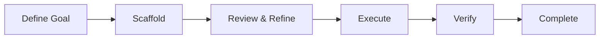

# Fest CLI

> **Part of [Festival](https://github.com/Obedience-Corp/festival)** - mission-based AI workspace management. Fest handles hierarchical planning; [camp](https://github.com/Obedience-Corp/camp) handles workspace management. Together they give structure to how you work across multiple projects, contexts, and AI agents.


Fest is a CLI tool for working with **Festival Methodology** - a hierarchical agentic planning and execution system designed for AI agent workflows. Festival plans in **steps to completion**, not time estimates - what matters is the sequence of steps between where you are and where you need to be.

Festivals live within **campaigns** - isolated workspaces managed by [camp](https://github.com/Obedience-Corp/camp). A campaign organizes your projects, plans, and context in one place. See the [methodology README](methodology/README.md) for the full picture.

## What is Festival Methodology?

A goal-based methodology that helps you **collaboratively create actionable tasks** for AI agents to execute in long-running autonomous sessions. Festival transforms high-level objectives into structured, executable work that AI can complete independently.



Festival enables:

- **Sustained autonomous builds** - AI agents work through complex projects step by step without losing context
- **Goal-driven development** - Hierarchical goals with built-in evaluation frameworks at every level
- **Executable specifications** - Every task includes concrete steps AI can follow
- **Context preservation** - Decisions and rationale maintained across sessions via CONTEXT.md
- **Autonomy awareness** - Tasks marked for independent vs collaborative work
- **Parallel execution** - Multiple agents work simultaneously on different parts

### Three-Level Structure

Festival organizes work into **phases**, **sequences**, and **tasks**:

```text
Goal: Build E-Commerce Platform
├── FESTIVAL_GOAL.md                    # Overall success metrics
├── FESTIVAL_OVERVIEW.md                # Project description
├── fest.yaml                           # Configuration
│
├── 001_PLAN/ (type: planning)          # Uses WORKFLOW.md
│   ├── PHASE_GOAL.md
│   ├── WORKFLOW.md                     # Step-by-step planning guidance
│   ├── inputs/                         # Reference materials
│   ├── decisions/                      # Captured decisions
│   └── plan/                           # Resulting plans
│
├── 002_IMPLEMENT/ (type: implementation)  # Uses numbered sequences
│   ├── PHASE_GOAL.md
│   ├── 01_backend/
│   │   ├── SEQUENCE_GOAL.md
│   │   ├── 01_database_setup.md
│   │   ├── 02_api_endpoints.md
│   │   ├── 03_testing.md              # Quality gate
│   │   ├── 04_review.md               # Quality gate
│   │   └── 05_iterate.md              # Quality gate
│   └── 02_frontend/
│       ├── SEQUENCE_GOAL.md
│       ├── 01_components.md
│       ├── 02_state_management.md
│       ├── 03_testing.md              # Quality gate
│       ├── 04_review.md               # Quality gate
│       └── 05_iterate.md              # Quality gate
│
└── 003_VALIDATE/ (type: review)
    └── PHASE_GOAL.md
```

**Key distinction**: Planning phases use `WORKFLOW.md` for guided process. Implementation phases use numbered sequences with task files. This is the most important structural concept in Festival.

## What fest Does

Fest is both a **planning and scaffolding tool** and an **agent guidance system**. It teaches agents how to work with Festival Methodology and guides them through execution with minimal context overhead.

**Agent Guidance System:**

- Built-in documentation teaches agents the methodology on-demand (`fest intro`, `fest understand`)
- Agents learn what they need, when they need it - no upfront context dump
- `fest next` shows agents exactly what to work on next with full inline context
- Self-documenting commands guide agents through proper usage

**Project Management:**

- **Create**: Interactive TUI for scaffolding festivals, phases, sequences, and tasks
- **Validate**: Check festival structure for issues and auto-fix common problems
- **Navigate**: Quick commands to jump between festivals, phases, and sequences
- **Track**: Monitor completion status across all levels

## Installation

```bash
# Install from source
git clone https://github.com/Obedience-Corp/fest
cd fest
just install
```

Or with Go:

```bash
go install github.com/Obedience-Corp/fest/cmd/fest@latest
```

## Shell Integration (Recommended)

Add to your shell config for quick navigation commands:

```bash
# Zsh/Bash
eval "$(fest shell-init zsh)"

# Fish
fest shell-init fish | source
```

This gives you:

- `fgo` - Quick navigation (`fest go`)
- `fls` - Quick listing (`fest list`)
- Tab completion for all fest commands

## Agent Workflow

The typical workflow for AI agents:

### 1. Learn the Methodology

```bash
fest intro                    # Start here - getting started guide
fest understand methodology   # Core principles
fest understand structure     # 3-level hierarchy
```

### 2. Scaffold

Choose a festival type to auto-scaffold the right structure:

| Type | Auto-Scaffolded Phases | When to Use |
|------|----------------------|-------------|
| **standard** | INGEST + PLAN | Most projects - gather requirements then plan |
| **implementation** | IMPLEMENT | Requirements already defined |
| **research** | INGEST + RESEARCH + SYNTHESIZE | Investigation or exploration |
| **ritual** | Custom (no defaults) | Recurring processes |

```bash
fest init                                          # Initialize festivals directory
fest create festival --type standard "my-project"  # Auto-scaffolds phases
fest create phase                                  # Add more phases
fest create sequence                               # Add sequences to phases
```

### 3. Review & Refine

Review the full plan before agents start executing:

```bash
fest validate                 # Check structure for issues
fest validate --fix           # Auto-fix common problems
fest show --roadmap           # Full execution roadmap with task statuses
fest status                   # Festival progress overview
```

### 4. Execute

```bash
fest next                     # Get next task with full context
fest task completed           # Mark current task done
fest commit -m "message"      # Git commit with festival tracking
```

For workflow phases (planning, research, ingest):

```bash
fest workflow status           # Current step in the workflow
fest workflow show             # Full details of current step
fest workflow advance          # Complete step, move to next
```

### 5. Verify

Quality gates run at the end of every implementation sequence (testing, review, iterate):

```bash
fest progress                 # Track execution progress
fest gates apply --approve    # Propagate quality gates to all sequences
```

### 6. Complete

```bash
fest promote                  # Move festival to next lifecycle status
```

## Quick Commands

After shell integration:

| Command | Full Form | Purpose |
|---------|-----------|---------|
| `fgo` | `fest go` | Toggle between linked festival and project directories |
| `fgo <name>` | `fest go <name>` | Navigate to a specific festival |
| `fgo 2` | `fest go 2` | Go to phase 002 |
| `fgo 2/1` | `fest go 2/1` | Go to phase 2, sequence 1 |
| `fgo active` | `fest go active` | Go to active festivals |
| `fls` | `fest list` | List festivals by status |
| `fls active` | `fest list active` | List active festivals |

**Smart Navigation**: `fgo` with no arguments toggles between a festival directory and its linked project directory (set up with `fest link`). This makes it easy to jump back and forth between planning and implementation.

## Command Reference

Fest has 40+ commands organized into 7 groups (Learning, Creation, Structure, Workflow, Query, Navigation, System). The most common commands are covered in the [Agent Workflow](#agent-workflow) section above.

For the full reference with flags, examples, and JSON output formats, see [docs/cli-reference/](docs/cli-reference/) or run:

```bash
fest --help              # All commands grouped by category
fest [command] --help    # Detailed help for any command
```

## Configuration

Config stored at `~/.config/fest/config.json`. Run `fest config show` to view.

## Development

Uses `just` for all build/test commands:

```bash
just              # List all commands
just build        # Build fest binary
just test         # Testing commands (unit, integration, coverage)
just install      # Install to $GOBIN
just lint         # Format and vet
just clean        # Clean build artifacts
just docs         # Generate CLI reference docs
```

Subcommand modules:

```bash
just test         # Testing commands
just xbuild       # Cross-platform builds
just release      # Release packaging
just tags         # Git tag management
```

## Part of Festival

Fest is one half of the Festival product. The other half is [camp](https://github.com/Obedience-Corp/camp), which manages campaign workspaces - isolated environments for individual missions. Camp creates the workspace (`camp init`), fest manages the planning and execution within it. Together, camp + fest = Festival.

- [Festival documentation](https://fest.build) - Full docs, methodology, tutorials
- [camp CLI](https://github.com/Obedience-Corp/camp) - Campaign workspace management
- [Festival repo](https://github.com/Obedience-Corp/festival) - Distribution hub and releases

## License

Business Source License 1.1 - See [LICENSE](LICENSE) for details.
