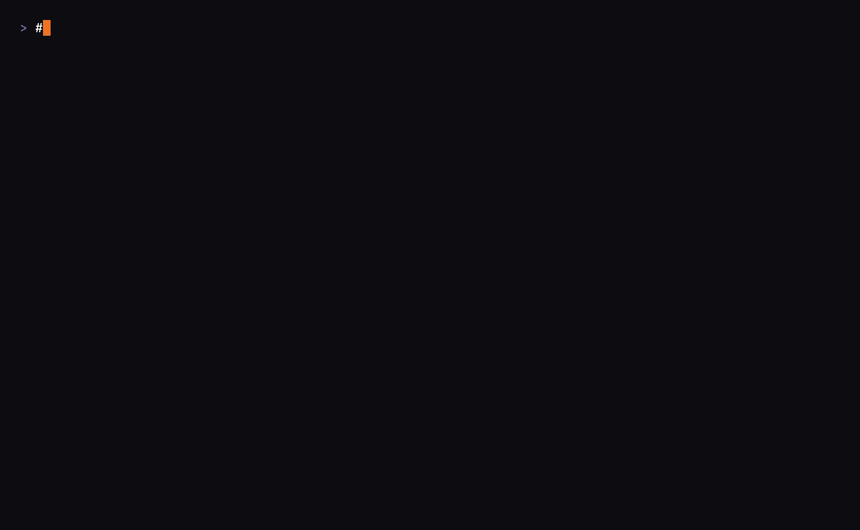
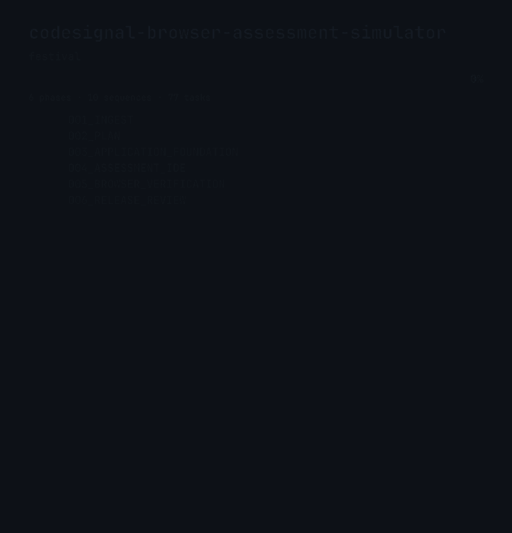

# Fest CLI

**Manage the work, not the agents.**

Fest turns complex goals into plans your coding agents can execute, verify, and
resume across sessions. Keep the plan, decisions, and progress in your repo.
Use the coding agent you already work with.

<p align="center">
  <a href="https://github.com/Obedience-Corp/fest/stargazers"></a>
  <a href="https://pkg.go.dev/github.com/Obedience-Corp/fest"></a>
  <a href="https://coveralls.io/github/Obedience-Corp/fest"></a>
</p>

<p align="center">
  
</p>
<p align="center"><em><code>fest next</code> gives your agent its next task and context. <code>fest watch</code> shows progress as the work lands.</em></p>

[Get started](#get-started) · [See a real project](#a-real-project-across-three-agent-tools) · [Documentation](https://docs.fest.build/) · [Share a replay](#share-what-you-built)

Fest is the planning and execution CLI in [Festival](https://github.com/Obedience-Corp/festival).
The suite includes `camp` for workspaces, `fest` for plans and execution, and
`festival` for installation and updates. Your coding agent runs the work;
Fest supplies the next step, tracks progress, and checks configured gates.

## Get started

Install the Festival suite using **one** of these methods:

```bash
# macOS with Homebrew
brew install --cask Obedience-Corp/tap/festival

# Or npm on macOS/Linux with Node.js installed
npm install -g @obedience-corp/festival
```

Both install `camp`, `fest`, and `festival`. Git is required. For Linux packages
and other methods, see the [installation guide](https://docs.fest.build/getting-started/installation/).
Stable Windows packages are temporarily paused; use WSL2 with a Linux install.

Check the installation, then create a camp for your work:

```bash
festival doctor
camp init my-camp
cd my-camp

# Replace this with the absolute path to your existing repository
camp project link /path/to/your-existing-repo
```

A camp holds related projects, plans, and context. Linking a project keeps it in
its current location and adds a `.camp` attachment file. To clone a repository
into the camp instead, use `camp project add <repo-url>`.

Open your coding agent at the camp root. Replace the brackets and give it a goal:

```text
Read AGENTS.md and run fest intro.

In [project name], I want [specific outcome].
Success means [what I should be able to verify].
Constraints: [scope, compatibility, or other requirements].

Use fest to create and plan a festival for this goal. Ask about missing
requirements, fill the required markers, and validate the plan. Link the
festival to the project or worktree where you will implement it.
Show me the plan before starting implementation.
```

Once you have reviewed the plan, tell the agent to execute it:

```text
The plan is approved. Work from the linked project or worktree.
Run fest next, follow its instructions, verify the results, record progress,
and repeat. Stop at approval gates, blockers, or decisions that need me.
Finish with the verification results and what I should review.
```

The CLI includes guidance agents can read on demand. See the
[agent setup guides](https://docs.fest.build/getting-started/agents/) for your tool,
or follow the [full quick start](https://docs.fest.build/getting-started/quickstart/)
with recordings of the setup and handoff.

## What you get

- **Resume across sessions.** Plans, task status, and recorded decisions stay on
  disk. A new session can read them and use `fest next` to find the next step.
- **Switch agents.** Use Claude Code, Codex, Grok Build, or another agent that can
  read files and run commands. The work record belongs to your workspace.
- **Review against a goal.** Give tasks completion criteria and end implementation
  sequences with testing, review, and iteration gates. Trace commits back to the
  plan with `fest commit`.
- **See the work move.** Inspect the plan with `fest show`, follow it live with
  `fest watch`, and share recorded progress with `fest gif`.
- **Keep your own workflow.** Edit the templates, define festival types, and
  configure gates and hooks for the way you work.

Use a festival when the work has dependencies, requires decisions, spans
sessions, or needs to follow specific patterns. A feature across services, an
infrastructure migration, a research investigation, or a substantial refactor
can all use the same loop. A task an agent can finish in one session may not
need a full festival.

You still set the goal and review the result. How much supervision a run needs
depends on the plan, the agent, the available checks, and the decisions involved.

## A real project across three agent tools

[Camp Hardening](https://github.com/Festival-Examples/example-camp-hardening-festival)
was planned in Claude Code (Fathom), executed in Grok Build, and finished in
Codex after a handoff partway through the four-day effort. The plan and progress
stayed with the work as the agent changed.

Browse the public festival's goals, task files, and completed work. The
[project story](https://fest.build/stories/camp-hardening) walks through the run
and its results. Use that record to judge whether the workflow fits your work.

## How the loop works

A **festival** is a plan and work record for a goal. It breaks work into phases,
sequences, and tasks, with goals and completion criteria at each level:

```text
my-feature/
├── FESTIVAL_GOAL.md
├── FESTIVAL_OVERVIEW.md
├── fest.yaml
├── 001_INGEST/
│   ├── PHASE_GOAL.md
│   └── WORKFLOW.md
├── 002_PLAN/
│   ├── PHASE_GOAL.md
│   └── WORKFLOW.md
└── 003_IMPLEMENT/
    ├── PHASE_GOAL.md
    └── 01_api/
        ├── SEQUENCE_GOAL.md
        ├── 01_endpoints.md
        └── ... testing, review, iteration, and commit gates
```

This is an example of a planned festival. The standard type initially scaffolds
INGEST and PLAN; implementation phases and tasks are added during planning.
Workflow phases use `WORKFLOW.md` to guide steps and checkpoints. Implementation
phases use numbered sequences and task files.

From a festival or its linked project, the agent uses:

```bash
fest next                     # Read the next step and its surrounding context
# Do the work and run the checks described in the task
fest task completed --yes     # Record completion without an interactive prompt
fest commit -m "Describe the change"
fest next                     # Continue from the recorded state
```

For workflow phases, follow `fest workflow show` and advance completed steps
with `fest workflow advance`. Approval gates can pause the loop. The agent
should follow the instructions returned by `fest next` for the current phase.

`fest validate` checks plan structure and required content. Task criteria,
project tests, and reviews establish whether the delivered work meets the goal.
Maintain decisions and handoff notes alongside the plan: `CONTEXT.md` is a
supported place for them, but you or your agent must create and update it;
scaffolding does not generate it.

This is **loop engineering**: define the goals, steps, checks, and feedback your
agent follows. Plan around steps to completion, dependencies, and evidence.
Read the [methodology](methodology/README.md) for phase types and planning rules,
and [loops and orchestration](https://docs.fest.build/guides/loops-and-orchestration/)
for running multiple festivals.

## Your templates, your workflow

Fest ships with a default methodology you can inspect and change:

| Customize | Where to start |
| --- | --- |
| Festival, phase, sequence, and task documents | `festivals/.festival/templates/` |
| Festival types and their initial phases | `festivals/.festival/festival_types.yaml` |
| Quality gates | Camp defaults in `.festival/`, with per-festival overrides |
| Lifecycle hooks | Named commands in machine, workspace, or festival configuration |
| Shared template sets | Configure a repository and use `fest system sync` |

You can use a team's own template repository. See [templates](docs/templates.md)
and [configuration](docs/configuration.md) for the supported settings.

Hooks can run commands on lifecycle events such as task completion. An optional
`approval_judge` hook can evaluate eligible checkpoints and return a verdict
with fixes. Steps marked `approval: human-required` still require a person.
Fresh configurations run no hooks until you declare them. See the
[hooks guide](docs/concepts/hooks.md) for setup and the judge protocol.

Configuration has three layers: machine settings in `~/.obey/fest/config.json`,
workspace settings in `festivals/.festival/config.yaml`, and festival settings
in `fest.yaml`. `fest config show` reports the active template configuration
repository; it does not dump every effective setting.

## Share what you built

Render a festival's recorded progress as a GIF:

```bash
fest gif
```

<p align="center">
  
</p>

The replay shows recorded tasks, workflow steps, gates, and hook results in
order. Share it with a link to the plan and the resulting code or deliverable
so others can inspect the work behind the animation.

Completing a festival also generates a replay and embeds it in
`FESTIVAL_OVERVIEW.md`. Use `fest gif --embed` to refresh that section, including
for older festivals. See the [replay guide](docs/guides/replays.md) for playback
options, missing-history behavior, and recovery if rendering fails.

If Fest helps you finish something, [star the repo](https://github.com/Obedience-Corp/fest)
and share your run.

## Navigation and command reference

Choose the integration for your shell and add it to that shell's startup file:

```bash
# Zsh (~/.zshrc)
eval "$(fest shell-init zsh)"

# Bash (~/.bashrc)
eval "$(fest shell-init bash)"
```

For Fish, add `fest shell-init fish | source` to `~/.config/fish/config.fish`.

| Command | Purpose |
| --- | --- |
| `fgo` | Navigate between a linked festival and project |
| `fgo 2/1` | Go to phase 2, sequence 1 |
| `fls active` | List active festivals |
| `fest show` | Inspect the festival tree and progress |
| `fest watch` | Follow live progress |
| `fest --help` | Find commands by category |
| `fest <command> --help` | Read flags and examples |

Shell integration wraps `fest` in a function so navigation can change your
working directory. See [shell setup](https://docs.fest.build/getting-started/shell-setup/)
for setup details and troubleshooting.

## Documentation and contributing

- [Festival documentation](https://docs.fest.build/): setup, tutorials, and use cases.
- [Methodology](methodology/README.md): goals, phase types, and planning conventions.
- [CLI reference](docs/cli-reference/): command flags and examples.
- [Lifecycle](docs/lifecycle.md): promotion and completion.
- [Configuration](docs/configuration.md), [templates](docs/templates.md), and [hooks](docs/concepts/hooks.md): customize the workflow.
- [Contributing](CONTRIBUTING.md): contribution requirements and sign-off policy.

To build and install Fest itself from source, use the Go version required by
[go.mod](go.mod) and install [just](https://github.com/casey/just):

```bash
git clone https://github.com/Obedience-Corp/fest.git
cd fest
just install stable           # Build and install to $GOBIN (or GOPATH/bin)
```

For development:

```bash
just --list                   # Discover recipes and modules
just build quick-stable       # Build the stable CLI
just check                    # Build, vet, lint, CLI docs, and unit tests
just test integration         # Integration tests (requires Docker)
just docs                     # Regenerate CLI reference after command changes
```

## License

[Apache License 2.0](LICENSE).
