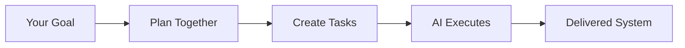

# Festival Methodology

[](LICENSE)

A goal-based methodology that helps you **collaboratively create actionable tasks** for AI agents to execute in long-running autonomous sessions. Festival transforms high-level objectives into structured, executable work that AI can complete independently.

## What Festival Does

Festival bridges the gap between what you want to build and what AI agents can actually execute:



## Core Benefits

Festival enables:

- **Long-running autonomous builds** - AI agents work for hours or days, not minutes
- **Goal-driven development** - Hierarchical goals with built-in evaluation frameworks
- **Executable specifications** - Every task includes concrete steps AI can follow
- **Context preservation** - Decisions and rationale maintained across sessions
- **Autonomy awareness** - Tasks marked for independent vs collaborative work
- **Parallel execution** - Multiple agents work simultaneously on different parts

## Campaigns: The Workspace Layer

A **campaign** is an isolated workspace for a single mission - your day job, a startup, an open-source project. Everything related to that mission lives in one place: projects, plans, research, and context.

The `camp` CLI creates and manages campaigns:

```bash
camp init my-startup          # Create a campaign workspace
camp project add <url>        # Add a project as a submodule
camp doctor                   # Health check the workspace
```

### Campaign Structure

```
my-startup/                        # Campaign root
├── projects/                      # Git submodules for all code
│   ├── api/
│   ├── frontend/
│   └── docs-site/
├── festivals/                     # Festival planning workspace
│   ├── planning/                  # Festivals being designed
│   ├── ready/                     # Planned, awaiting execution
│   ├── active/                    # Currently executing
│   ├── ritual/                    # Recurring processes
│   └── dungeon/                   # Terminal statuses
│       ├── completed/             # Successfully finished
│       ├── archived/              # Preserved for reference
│       └── someday/               # Deprioritized for later
├── workflow/                      # Lightweight planning (no festival needed)
│   ├── intents/                   # Ideas, bugs, features (inbox -> done)
│   ├── design/                    # Architecture docs, API specs, wireframes
│   ├── code_reviews/              # Code review materials
│   └── pipelines/                 # CI/CD definitions
├── docs/                          # Human-authored documentation
├── ai_docs/                       # AI research and documentation
└── CLAUDE.md                      # Agent instructions
```

Festivals live inside campaigns, but **not all planning requires a festival**. Campaigns provide lighter-weight planning tools too:

### Intents - Lightweight Idea Capture

Intents capture raw ideas before they're ready for a festival. No structure required - just get the thought down.

```bash
camp intent add "dark mode support"    # Fast capture
camp intent add --edit                 # Capture with full context
camp intent move <id> ready            # Advance through lifecycle
camp intent promote <id>               # Convert to a festival
```

Intents follow a lifecycle: `inbox/` -> `active/` -> `ready/` -> `done/` or `killed/`. When an intent is clear enough to act on, promote it to a festival.

### Design Documents

The `workflow/design/` directory is for quick design iteration - architecture decisions, API specs, wireframes. Design docs often evolve into festivals when the scope becomes clear enough to plan formally.

## What Makes Festival Different

### Hierarchical Goal System

Every level of your project has clear, measurable goals:

- **Festival Goals** - Overall success criteria and KPIs
- **Phase Goals** - Stage-specific objectives that build toward the festival goal
- **Sequence Goals** - Granular targets that ensure phase completion

Each goal includes evaluation frameworks, so you always know if you've succeeded.

### Context Preservation

The `CONTEXT.md` file captures:

- Key decisions and rationale
- Session handoff notes
- Open questions for human review
- Lessons learned during execution

This maintains continuity across AI sessions and human reviews.

### Autonomy Levels

Every task is marked with an autonomy level:

- **High** - Agent completes independently
- **Medium** - May need edge case clarification
- **Low** - Expect human collaboration

This helps agents know when to proceed vs when to ask for help.

### Just-In-Time Documentation

Agents read templates and examples only when needed, preserving context window for actual work.

## The Three-Level Structure

Festival organizes work into **phases**, **sequences**, and **tasks**:

```text
Goal: Build E-Commerce Platform
├── FESTIVAL_GOAL.md                    # Overall success metrics
├── FESTIVAL_OVERVIEW.md                # Project description
├── fest.yaml                           # Configuration
│
├── 001_PLAN/ (type: planning)          # Uses WORKFLOW.md
│   ├── PHASE_GOAL.md
│   ├── WORKFLOW.md                     # Step-by-step planning guidance
│   ├── inputs/                         # Reference materials
│   ├── decisions/                      # Captured decisions
│   └── plan/                           # Resulting plans
│
├── 002_IMPLEMENT/ (type: implementation)  # Uses numbered sequences
│   ├── PHASE_GOAL.md
│   ├── 01_backend/
│   │   ├── SEQUENCE_GOAL.md
│   │   ├── 01_database_setup.md
│   │   ├── 02_api_endpoints.md
│   │   ├── 03_testing.md              # Quality gate
│   │   ├── 04_review.md               # Quality gate
│   │   └── 05_iterate.md              # Quality gate
│   └── 02_frontend/
│       ├── SEQUENCE_GOAL.md
│       ├── 01_components.md
│       ├── 02_state_management.md
│       ├── 03_testing.md              # Quality gate
│       ├── 04_review.md               # Quality gate
│       └── 05_iterate.md              # Quality gate
│
└── 003_VALIDATE/ (type: review)
    └── PHASE_GOAL.md
```

**Key distinction**: Planning phases use `WORKFLOW.md` for guided process. Implementation phases use numbered sequences with task files. This is the most important structural concept in Festival.

## Phase Types

Every phase has a **type** that determines its internal structure:

| Phase Type | Purpose | Structure | When to Use |
|-----------|---------|-----------|-------------|
| **planning** | Design, architecture, requirements | `WORKFLOW.md` + `inputs/` + `decisions/` + `plan/` | Breaking down goals into plans |
| **implementation** | Writing code, building features | Numbered sequences with task files | Executing defined work |
| **research** | Investigation, exploration, auditing | `WORKFLOW.md` + `sources/` + `findings/` | Exploring unknowns |
| **ingest** | Absorbing external content, data migration | `WORKFLOW.md` + `input_specs/` + `output_specs/` | Processing external inputs |
| **review** | Code review, testing, validation | Freeform with `PHASE_GOAL.md` | Verifying completed work |
| **non_coding_action** | Documentation, process changes | Freeform with `PHASE_GOAL.md` | Non-code deliverables |

### Workflow Phases vs Implementation Phases

This is the core structural distinction:

**Workflow phases** (planning, research, ingest) use a `WORKFLOW.md` file that provides step-by-step guidance with checkpoints. No numbered sequences - the workflow document IS the structure.

Each step in a WORKFLOW.md includes:
- **Goal** - What this step accomplishes
- **Actions** - Ordered list of things to do
- **Output** - Expected result
- **Checkpoint** - Optional approval gate (none, user_approval, documentation, verification)

```bash
fest workflow status     # Show current step progress
fest workflow show       # Display current step details
fest workflow advance    # Complete step, move to next
fest workflow approve    # User approves a blocking checkpoint
fest workflow reject     # Reject with feedback
```

**Implementation phases** use numbered sequences containing task files. Every implementation sequence ends with quality gates.

### Quality Gates

Every implementation sequence MUST end with quality gate tasks:

```
01_feature_code.md
02_more_code.md
03_testing.md            # Run tests, verify functionality
04_review.md             # Code review checklist
05_iterate.md            # Address feedback, iterate
```

Quality gates are auto-propagated to all sequences:

```bash
fest gates apply --approve    # Add gates to all sequences
```

## Festival Types

When creating a festival, choose a type to get auto-scaffolded phases:

| Festival Type | Auto-Scaffolded Phases | When to Use |
|--------------|------------------------|-------------|
| **standard** | INGEST (ingest) + PLAN (planning) | Most projects - need to gather requirements then plan |
| **implementation** | IMPLEMENT (implementation) | Requirements already defined, just execute |
| **research** | INGEST (ingest) + RESEARCH (research) + SYNTHESIZE (planning) | Investigation, audit, or exploration work |
| **ritual** | Custom (no defaults) | Recurring or repeatable processes |

```bash
fest create festival --type standard "my-project"
fest create festival --type implementation "my-feature"
fest create festival --type research "my-investigation"
```

## How It Works: From Goal to Execution

### 1. Define Your Goal

You specify what you want to achieve - a complete feature, system, or product.

### 2. Create Goal Hierarchy

Festival helps structure your goal into measurable objectives at every level.

### 3. Plan with Autonomy Levels

Break down work into tasks, marking which can be done autonomously.

### 4. Execute with Context Tracking

AI agents work independently, documenting decisions in CONTEXT.md.

### 5. Evaluate Against Goals

Review progress using built-in evaluation frameworks.

### 6. Iterate or Complete

Based on goal achievement, refine and continue or mark complete.

## Creating Actionable Tasks

Festival tasks aren't vague descriptions - they're complete specifications AI can execute:

```markdown
# Task: 01_implement_user_authentication.md

**Autonomy Level:** high # Agent can complete independently

## Objective

Create JWT-based authentication with email/password login

## Requirements

- [ ] User registration endpoint
- [ ] Login with email/password
- [ ] JWT token generation (15min access, 7day refresh)
- [ ] Password hashing with bcrypt
- [ ] Rate limiting (5 attempts/minute)

## Implementation Steps

1. Install dependencies:
   npm install jsonwebtoken bcrypt express-rate-limit

2. Create database schema:
   - users table (id, email, password_hash, created_at)
   - refresh_tokens table (token, user_id, expires_at)

3. Implement endpoints:
   - POST /api/auth/register
   - POST /api/auth/login
   - POST /api/auth/refresh
   - POST /api/auth/logout

## Validation

- Test registration with: curl -X POST localhost:3000/api/auth/register ...
- Verify JWT expiration times
- Check rate limiting blocks after 5 attempts
- Ensure passwords are hashed, not plain text

## Deliverables

- [ ] src/routes/auth.js - Authentication endpoints
- [ ] src/middleware/auth.js - JWT verification
- [ ] src/models/User.js - User model with password hashing
- [ ] tests/auth.test.js - Complete test coverage
```

This level of detail, combined with autonomy levels, enables AI agents to work independently while knowing when to seek help.

## Real-World Usage

Festival Methodology is **actively used and refined through daily development**. It's a living system that evolves based on practical experience:

- Extends autonomous AI coding sessions from hours to multiple days
- Reduces context switching between human and AI work
- Enables complex feature development with minimal supervision
- Particularly effective with tools like Claude Code, Cursor, and Windsurf

### Realistic Expectations

- **Festival gets you 90% there autonomously** - AI agents handle the bulk of implementation
- **Human expertise guides the final 10%** - Your insight ensures quality and correctness
- **Goals evolve as you learn** - Multiple festivals may be needed as requirements clarify
- **Best for complex, multi-day projects** - Not needed for simple, single-task work

## Getting Started

### 1. Create a Campaign

```bash
# Install festival (includes fest + camp CLIs)
brew install Obedience-Corp/tap/festival

# Shell integration (add to ~/.zshrc)
eval "$(camp shell-init zsh)"
eval "$(fest shell-init zsh)"

# Create a campaign workspace
camp init my-project && cd my-project
```

### 2. Create Your First Festival

```bash
# Create a standard festival (ingest + plan phases auto-scaffolded)
fest create festival --type standard "my-first-feature"

# See what was created
fest status
```

### 3. Work Through It

```bash
# Get the next task with full context
fest next

# For workflow phases, follow the guided steps
fest workflow status
fest workflow advance

# Mark tasks complete as you go
fest task completed

# Commit with festival tracking
fest commit -m "implement auth endpoints"
```

### 4. Learn the Methodology

```bash
fest understand methodology    # Core principles
fest understand structure      # Three-level hierarchy
fest understand tasks          # Task creation guidance
fest understand workflow       # Workflow phase patterns
```

## Festival vs Other Approaches

| Aspect              | Festival                      | Traditional PM | Ad-hoc AI          |
| ------------------- | ----------------------------- | -------------- | ------------------ |
| **Focus**           | Goal achievement via tasks    | Task tracking  | Quick answers      |
| **Task Detail**     | Complete executable specs     | User stories   | Vague prompts      |
| **Execution Time**  | Hours to days                 | Sprint cycles  | Minutes            |
| **Context**         | Persists in CONTEXT.md        | Meeting notes  | Lost between chats |
| **AI Autonomy**     | Guided by autonomy levels     | N/A            | Constant prompting |
| **Collaboration**   | Human-AI task creation        | Human teams    | Human directs      |
| **Success Metrics** | Built-in evaluation framework | Retrospectives | Undefined          |

## Directory Structure

### Campaign Level

```
my-campaign/
├── projects/                           # Git submodules
├── festivals/                          # Festival workspace
│   ├── planning/                       # Being designed
│   ├── ready/                          # Awaiting execution
│   ├── active/                         # Currently executing
│   ├── ritual/                         # Recurring processes
│   └── dungeon/                        # Terminal statuses
│       ├── completed/                  # Successfully finished
│       ├── archived/                   # Preserved for reference
│       └── someday/                    # Deprioritized
├── workflow/                           # Lightweight planning
│   ├── intents/                        # Ideas and work items
│   ├── design/                         # Architecture docs
│   ├── code_reviews/                   # Review materials
│   └── pipelines/                      # CI/CD definitions
└── CLAUDE.md                           # Agent instructions
```

### Inside a Festival

```
auth_system/
├── FESTIVAL_GOAL.md                    # Overall success criteria
├── FESTIVAL_OVERVIEW.md                # Project description
├── FESTIVAL_RULES.md                   # Quality standards
├── fest.yaml                           # Configuration
├── TODO.md                             # Progress tracking
│
├── 001_INGEST/ (type: ingest)
│   ├── PHASE_GOAL.md
│   ├── WORKFLOW.md                     # Guided ingestion process
│   ├── input_specs/                    # What was provided
│   └── output_specs/                   # Structured output
│
├── 002_PLAN/ (type: planning)
│   ├── PHASE_GOAL.md
│   ├── WORKFLOW.md                     # Guided planning process
│   ├── inputs/                         # Reference from previous phases
│   ├── decisions/                      # Architectural decisions
│   └── plan/                           # Resulting implementation plan
│
├── 003_IMPLEMENT/ (type: implementation)
│   ├── PHASE_GOAL.md
│   ├── 01_backend/                     # Numbered sequences
│   │   ├── SEQUENCE_GOAL.md
│   │   ├── 01_database_setup.md
│   │   ├── 02_api_endpoints.md
│   │   ├── 03_testing.md              # Quality gate
│   │   ├── 04_review.md               # Quality gate
│   │   └── 05_iterate.md              # Quality gate
│   └── 02_frontend/
│       ├── SEQUENCE_GOAL.md
│       └── ...
│
└── 004_VALIDATE/ (type: review)
    └── PHASE_GOAL.md
```

### Naming Conventions

- **Phases**: 3-digit prefix (001_, 002_, 003_) - supports up to 999 phases
- **Sequences**: 2-digit prefix (01_, 02_) within phases
- **Tasks**: 2-digit prefix (01_*.md, 02_*.md) within sequences
- **Parallel tasks**: Same number prefix indicates tasks that can run simultaneously

## What's Included

### Templates

- **Goal Templates** - Festival, Phase, and Sequence goal tracking
- **Task Templates** - With autonomy level support
- **Workflow Templates** - Phase-type-specific WORKFLOW.md files
- **Context Template** - For decision and rationale tracking
- **Quality Gate Templates** - Testing, review, and iterate gates

### AI Agents

- **Planning Agent** - Guides festival structure creation
- **Review Agent** - Validates methodology compliance
- **Manager Agent** - Enforces process during execution

## Why Festival Works

1. **Goals drive everything** - Clear success criteria at every level
2. **Tasks are complete** - No ambiguity, full specifications with autonomy guidance
3. **Context persists** - CONTEXT.md maintains continuity across sessions
4. **Phase types match the work** - Workflow guidance for planning, sequences for building
5. **Quality gates enforce standards** - Every implementation sequence ends with verification
6. **Parallel execution** - Multiple agents work simultaneously
7. **Human judgment preserved** - You guide strategy while AI handles implementation
8. **Living methodology** - Continuously refined through real-world use

---

**The Bottom Line**: Festival Methodology gives you campaigns for organizing missions, festivals for structuring complex work, and a clear distinction between planning (workflow-guided) and building (sequence-driven). AI agents work autonomously for extended periods using hierarchical goals, executable task specifications, and context preservation. It's structured collaboration that gets you 90% of the way there autonomously, with human expertise guiding the critical final steps.
