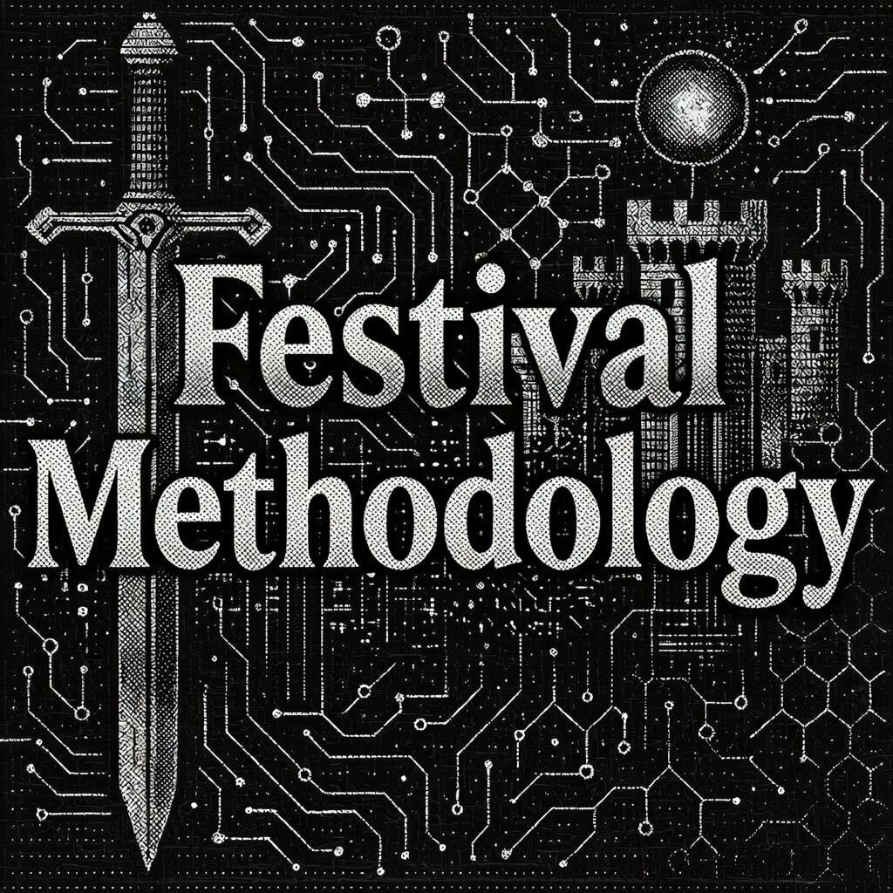
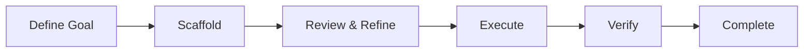

# Festival Methodology

[](LICENSE)

A goal-based methodology that helps you **collaboratively create actionable tasks** for AI agents to execute in long-running autonomous sessions. Festival transforms high-level objectives into structured, executable work that AI can complete independently.

## What Festival Does

Festival bridges the gap between what you want to build and what AI agents can actually execute:



## Steps, Not Time

Festival plans in **steps to completion**, not time estimates. AI agents work exponentially faster than humans and are improving faster than anyone can predict - a festival that takes a week today might take 10 minutes next month. Time-based estimation is meaningless in this context. What matters is the sequence of steps between where you are and where you need to be.

## Core Benefits

Festival enables:

- **Sustained autonomous builds** - AI agents work through complex projects step by step without losing context
- **Goal-driven development** - Hierarchical goals with built-in evaluation frameworks
- **Executable specifications** - Every task includes concrete steps AI can follow
- **Context preservation** - Decisions and rationale maintained across sessions
- **Autonomy awareness** - Tasks marked for independent vs collaborative work
- **Parallel execution** - Multiple agents work simultaneously on different parts

## When to Use a Festival

A festival scales to the work. It can be:

- A **complex feature** that spans multiple services and needs careful sequencing
- An **entire quarter's worth of epics** broken into phases with clear milestones
- All the **infrastructure for a new initiative** from zero to production
- A **massive refactor** that touches every layer of the stack

Festivals are useful when the work is non-trivial, non-standard, or needs to be done in a particular way. If you can describe the task in a single prompt and an agent can finish it in one session, you don't need a festival. If the work has dependencies, requires decisions, spans multiple sessions, or needs to follow specific patterns - that's what festivals are for.

## Camps: The Workspace Layer

A **camp**, previously called a campaign, is one workspace holding a group of related projects and the festivals you run in them. Your day job, a startup, an open-source project: each is its own camp.

The `camp` CLI creates and manages camps:

```bash
camp init my-startup          # Create a camp
camp project add <url>        # Add a project as a submodule
camp doctor                   # Health check the workspace
```

### Camp Structure

```
my-platform/                           # Camp root
├── projects/                          # 15+ project submodules
│   ├── api-gateway/
│   ├── auth-service/
│   ├── billing-service/
│   ├── frontend/
│   ├── mobile-app/
│   ├── shared-libs/
│   ├── infrastructure/
│   ├── docs-site/
│   └── ...
├── festivals/                         # Festival workspace
│   ├── planning/                      # Festivals being designed
│   ├── ready/                         # Planned, awaiting execution
│   ├── active/                        # Currently executing
│   ├── ritual/                        # Recurring processes
│   └── dungeon/                       # Terminal statuses
│       ├── completed/                 # Successfully finished
│       ├── archived/                  # Preserved for reference
│       └── someday/                   # Deprioritized for later
├── workflow/                          # Extensible workflow directories
│   ├── intents/                       # Default: ideas, bugs, features
│   ├── design/                        # Default: architecture docs, API specs
│   ├── code_reviews/                  # Default: review materials
│   ├── pipelines/                     # Default: CI/CD definitions
│   ├── proposals/                     # Custom: team proposals
│   ├── postman/                       # Custom: API collections
│   └── ...                            # Add any workflows you need
├── docs/                              # Human-authored documentation
├── ai_docs/                           # AI research and documentation
└── AGENTS.md                          # Agent instructions
```

The `workflow/` directory ships with sensible defaults (intents, design, code_reviews, pipelines) but is fully extensible: add directories for any recurring process your camp needs. Real camps include things like `proposals/`, `postman/`, `bugs/`, `feedback/`, `pitch/`, and `simulations/`.

Festivals live inside camps, but **not all planning requires a festival**. Camps also provide:

### Intents - Lightweight Idea Capture

Intents capture raw ideas before they're ready for a festival. No structure required - just get the thought down.

```bash
camp intent add "dark mode support"    # Fast capture
camp intent add --edit                 # Capture with full context
camp intent move <id> ready            # Advance through lifecycle
camp intent promote <id>               # Convert to a festival
```

Intents follow a lifecycle: `inbox/` -> `active/` -> `ready/` -> `done/` or `killed/`. When an intent is clear enough to act on, promote it to a festival.

### Design Documents

The `workflow/design/` directory is for quick design iteration - architecture decisions, API specs, wireframes. Design docs often evolve into festivals when the scope becomes clear enough to plan formally.

## What Makes Festival Different

### Hierarchical Goal System

Every level of your project has clear, measurable goals:

- **Festival Goals** - Overall success criteria and KPIs
- **Phase Goals** - Stage-specific objectives that build toward the festival goal
- **Sequence Goals** - Granular targets that ensure phase completion

Each goal includes evaluation frameworks, so you always know if you've succeeded.

### Context Preservation

The `CONTEXT.md` file captures:

- Key decisions and rationale
- Session handoff notes
- Open questions for human review
- Lessons learned during execution

This maintains continuity across AI sessions and human reviews.

### Autonomy Levels

Every task is marked with an autonomy level:

- **High** - Agent completes independently
- **Medium** - May need edge case clarification
- **Low** - Expect human collaboration

This helps agents know when to proceed vs when to ask for help.

### Just-In-Time Documentation

Agents read templates and examples only when needed, preserving context window for actual work.

## The Three-Level Structure

Festival organizes work into **phases**, **sequences**, and **tasks**:

```text
Goal: Build E-Commerce Platform
├── FESTIVAL_GOAL.md                    # Overall success metrics
├── FESTIVAL_OVERVIEW.md                # Project description
├── fest.yaml                           # Configuration
│
├── 001_PLAN/ (type: planning)          # Uses WORKFLOW.md
│   ├── PHASE_GOAL.md
│   ├── WORKFLOW.md                     # Step-by-step planning guidance
│   ├── inputs/                         # Reference materials
│   ├── decisions/                      # Captured decisions
│   └── plan/                           # Resulting plans
│
├── 002_IMPLEMENT/ (type: implementation)  # Uses numbered sequences
│   ├── PHASE_GOAL.md
│   ├── 01_backend/
│   │   ├── SEQUENCE_GOAL.md
│   │   ├── 01_database_setup.md
│   │   ├── 02_api_endpoints.md
│   │   ├── 03_testing.md              # Quality gate
│   │   ├── 04_review.md               # Quality gate
│   │   └── 05_iterate.md              # Quality gate
│   └── 02_frontend/
│       ├── SEQUENCE_GOAL.md
│       ├── 01_components.md
│       ├── 02_state_management.md
│       ├── 03_testing.md              # Quality gate
│       ├── 04_review.md               # Quality gate
│       └── 05_iterate.md              # Quality gate
│
└── 003_VALIDATE/ (type: review)
    └── PHASE_GOAL.md
```

**Key distinction**: Planning phases use `WORKFLOW.md` for guided process. Implementation phases use numbered sequences with task files. This is the most important structural concept in Festival.

## Phase Types

Every phase has a **type** that determines its internal structure:

| Phase Type | Purpose | Structure | When to Use |
|-----------|---------|-----------|-------------|
| **planning** | Design, architecture, requirements | `WORKFLOW.md` + `inputs/` + `decisions/` + `plan/` | Breaking down goals into plans |
| **implementation** | Writing code, building features | Numbered sequences with task files | Executing defined work |
| **research** | Investigation, exploration, auditing | `WORKFLOW.md` + `sources/` + `findings/` | Exploring unknowns |
| **ingest** | Absorbing external content, data migration | `WORKFLOW.md` + `input_specs/` + `output_specs/` | Processing external inputs |
| **review** | Code review, testing, validation | Freeform with `PHASE_GOAL.md` | Verifying completed work |
| **non_coding_action** | Documentation, process changes | Freeform with `PHASE_GOAL.md` | Non-code deliverables |

### Workflow Phases vs Implementation Phases

This is the core structural distinction:

**Workflow phases** (planning, research, ingest) use a `WORKFLOW.md` file that provides step-by-step guidance with checkpoints. No numbered sequences - the workflow document IS the structure.

Each step in a WORKFLOW.md includes:

- **Goal** - What this step accomplishes
- **Actions** - Ordered list of things to do
- **Output** - Expected result
- **Checkpoint** - Optional approval gate (none, user_approval, documentation, verification)

```bash
fest workflow status     # Show current step progress
fest workflow show       # Display current step details
fest workflow advance    # Complete step, move to next
fest workflow approve    # User approves a blocking checkpoint
fest workflow reject     # Reject with feedback
fest workflow skip       # Operator override (work was done outside the workflow)
```

### When to use reject, skip, and failed-gate remediation

Three operator actions look similar but record different audit trails. Pick the one that matches the real situation:

- `fest workflow reject --reason "..."` records that a checkpoint was reviewed and rejected. The step becomes blocked and waits for a revision. Use when the work itself needs to be redone in place.
- `fest workflow skip --reason "..."` records that the step was completed by some other means (off-workflow work, manual action, etc.). The step is treated as terminal. Use when the work is genuinely already done and you do not need a revision loop.
- `fest workflow reject --reason "..." --remediation-phase <PHASE>` records that a phase gate did not pass and links a remediation phase that will correct the underlying issues. The gate step enters `failed_with_remediation` and remains non-terminal. `fest next` routes into the remediation phase, and once that phase completes, `fest next` routes back to the failed gate for re-evaluation. Use this for the CW0003-style case where a review gate found real blockers and a new phase was added to fix them. This preserves an honest audit trail: the gate is logged as failed (not approved and not skipped) and is rechecked after remediation, instead of being silently passed.

Example flow:

```bash
fest workflow reject --reason "PR 302 is not ready" --remediation-phase 005_FIX_PR_302_AGGREGATE
fest next   # routes into 005_FIX_PR_302_AGGREGATE
# ... work through the remediation phase ...
fest next   # remediation complete; routes back to the failed gate for recheck
fest workflow approve   # gate passes the second time
```

**Implementation phases** use numbered sequences containing task files. Every implementation sequence ends with quality gates.

### Quality Gates

Quality gates are default tasks appended to the end of each sequence for quality checks:

```
01_feature_code.md
02_more_code.md
03_testing.md            # Run tests, verify functionality
04_review.md             # Code review checklist
05_iterate.md            # Address feedback, iterate
```

Sensible defaults are included, but gates are easily editable or replaceable: customize them at the camp level via the `.festival/` directory, or override on a per-festival basis.

```bash
fest gates apply --approve    # Propagate gates to all sequences
```

## Festival Types

When creating a festival, choose a type to get auto-scaffolded phases:

| Festival Type | Auto-Scaffolded Phases | When to Use |
|--------------|------------------------|-------------|
| **standard** | INGEST (ingest) + PLAN (planning) | Most projects, including the beginner path - gather requirements, then plan |
| **implementation** | IMPLEMENT (implementation) | Requirements are already defined enough to break down into phases, sequences, and task documents |
| **research** | INGEST (ingest) + RESEARCH (research) + SYNTHESIZE (planning) | Investigation, audit, or exploration work |
| **ritual** | Custom (no defaults) | Recurring or repeatable processes |

For a first festival, use `--type standard` explicitly. Use `implementation` only when requirements already exist and you do not need the ingest/plan scaffolding.

```bash
fest create festival --name "my-project" --type standard
fest create festival --name "my-feature" --type implementation
fest create festival --name "my-investigation" --type research
```

## How It Works: From Goal to Execution

### 1. Define Your Goal

You specify what you want to achieve - a complete feature, system, or product.

### 2. Create Goal Hierarchy

Festival helps structure your goal into measurable objectives at every level.

### 3. Plan with Autonomy Levels

Break down work into tasks, marking which can be done autonomously.

### 4. Execute with Context Tracking

AI agents work independently, documenting decisions in CONTEXT.md.

### 5. Evaluate Against Goals

Review progress using built-in evaluation frameworks.

### 6. Iterate or Complete

Based on goal achievement, refine and continue or mark complete.

## Creating Actionable Tasks

Festival tasks aren't vague descriptions - they're complete specifications AI can execute:

```markdown
# Task: 01_implement_user_authentication.md

**Autonomy Level:** high # Agent can complete independently

## Objective

Create JWT-based authentication with email/password login

## Requirements

- [ ] User registration endpoint
- [ ] Login with email/password
- [ ] JWT token generation (15min access, 7day refresh)
- [ ] Password hashing with bcrypt
- [ ] Rate limiting (5 attempts/minute)

## Implementation Steps

1. Install dependencies:
   npm install jsonwebtoken bcrypt express-rate-limit

2. Create database schema:
   - users table (id, email, password_hash, created_at)
   - refresh_tokens table (token, user_id, expires_at)

3. Implement endpoints:
   - POST /api/auth/register
   - POST /api/auth/login
   - POST /api/auth/refresh
   - POST /api/auth/logout

## Validation

- Test registration with: curl -X POST localhost:3000/api/auth/register ...
- Verify JWT expiration times
- Check rate limiting blocks after 5 attempts
- Ensure passwords are hashed, not plain text

## Deliverables

- [ ] src/routes/auth.js - Authentication endpoints
- [ ] src/middleware/auth.js - JWT verification
- [ ] src/models/User.js - User model with password hashing
- [ ] tests/auth.test.js - Complete test coverage
```

This level of detail, combined with autonomy levels, enables AI agents to work independently while knowing when to seek help.

## Real-World Usage

Festival Methodology is **battle-tested on complex, multi-month projects** and refined through daily use. It's a living system built on real-world experience across platform engineering, blockchain infrastructure, and multi-service architectures:

- Festivals **run until completion** regardless of complexity, and often finish much faster than you'd expect
- **Significant reduction in token usage** - structured context means agents spend less time figuring out what to do
- **Faster time to final solution** - agents follow defined paths instead of exploring blindly
- **Less iteration** - structured plans and pre-execution review mean fewer cycles of rework
- **Compounding productivity gains** - each festival builds on patterns from previous ones
- Used regularly with **Claude Code** and **Codex**; works with any agentic tool that has tool-calling ability

### Why It Works

The core value of Festival is that it **guides agents to do things the way the system configures them to be done**. The methodology files, templates, and festival documents all shape agent behavior. Users can customize the `.festival/` directory and individual festival files to ensure agents work the way they want - not just the defaults.

Festival structure also enables **pre-execution review and refinement**. Before any agent starts executing, you can review the full plan - phases, sequences, tasks, goals - and adjust until it's right. This front-loaded review produces far more predictable outcomes. When a festival completes, it's typically executed exactly according to plan because the agentic guidance system and structured documents leave far less room for variable results than unstructured prompting.

### Realistic Expectations

- **Festival gets you 90% there autonomously** - AI agents handle the bulk of implementation
- **Human expertise guides the final 10%** - Your insight ensures quality and correctness
- **Goals evolve as you learn** - Multiple festivals may be needed as requirements clarify
- **Best for complex, multi-day projects** - Not needed for simple, single-task work

## Using the fest CLI

The `fest` CLI is how you and your agents interact with festivals day-to-day.

### Finding What to Do Next

`fest next` is the most important command. It analyzes the festival structure, checks progress, and returns the next task with full layered context - goals from the festival, phase, and sequence levels plus the complete task content:

```bash
fest next                    # Full context for the next task
fest next --no-context       # Minimal output (just the task path and status)
fest next --path             # Just the file path (for piping to other tools)
```

For workflow phases, `fest next` detects the phase type and returns the current workflow step instead of a task file.

### Monitoring Progress

```bash
fest show                    # Current festival details (from cwd)
fest show --roadmap          # Full execution roadmap with task statuses
fest show --watch            # Continuously refresh display
fest list active             # List all active festivals
fest list all                # All festivals grouped by status
fest status                  # Festival status overview
fest progress                # Execution progress tracking
```

### Enforcing Structure

`fest validate` catches structural problems before agents hit them:

```bash
fest validate                # Check methodology compliance
fest validate --fix          # Auto-fix safe issues (add missing quality gates, etc.)
fest validate tasks          # Verify task files exist (not just goals)
fest validate quality-gates  # Check gates are present in implementation sequences
fest validate structure      # Naming conventions and hierarchy
```

### Working Through Workflow Phases

```bash
fest workflow status          # Current step in the workflow
fest workflow show            # Full details of current step
fest workflow advance         # Complete step, move to next
fest workflow approve         # Approve a blocking checkpoint
fest workflow reject          # Reject with feedback
```

### Working Through Implementation Phases

```bash
fest task completed           # Mark current task done
fest commit -m "message"     # Git commit with festival tracking
fest gates apply --approve   # Propagate quality gates to all sequences
```

### Customization

The `.festival/` directory at the root of your `festivals/` workspace contains methodology resources - templates, agents, and examples. These files shape how agents plan and execute:

- **Templates** control what gets scaffolded when you create phases, sequences, and tasks
- **Agent prompts** guide AI behavior during planning and execution
- **Quality gate templates** define what verification looks like

Modify these to match your team's standards. Individual festivals can also override defaults through their own `FESTIVAL_RULES.md` and `fest.yaml` configuration.

## Getting Started

### 1. Create a Camp

```bash
# Install festival (includes fest + camp CLIs)
brew install --cask Obedience-Corp/tap/festival

# Shell integration (add to ~/.zshrc)
eval "$(camp shell-init zsh)"
eval "$(fest shell-init zsh)"

# Create a camp
camp init my-project && cd my-project
```

### 2. Create Your First Festival

```bash
# Create a standard festival for the beginner path
fest create festival --name "my-first-feature" --type standard

# See what was created
fest status
```

### 3. Work Through It

```bash
# Get the next task with full context
fest next

# For workflow phases, follow the guided steps
fest workflow status
fest workflow advance

# Mark tasks complete as you go
fest task completed

# Commit with festival tracking
fest commit -m "implement auth endpoints"
```

### 4. Learn the Methodology

```bash
fest understand methodology    # Core principles
fest understand structure      # Three-level hierarchy
fest understand tasks          # Task creation guidance
fest understand workflow       # Workflow phase patterns
```

## Festival vs Other Approaches

| Aspect              | Festival                      | Traditional PM | Ad-hoc AI          |
| ------------------- | ----------------------------- | -------------- | ------------------ |
| **Focus**           | Goal achievement via tasks    | Task tracking  | Quick answers      |
| **Task Detail**     | Complete executable specs     | User stories   | Vague prompts      |
| **Planning Model**  | Steps to completion           | Sprint cycles  | One-shot prompts   |
| **Context**         | Persists in CONTEXT.md        | Meeting notes  | Lost between chats |
| **AI Autonomy**     | Guided by autonomy levels     | N/A            | Constant prompting |
| **Collaboration**   | Human-AI task creation        | Human teams    | Human directs      |
| **Success Metrics** | Built-in evaluation framework | Retrospectives | Undefined          |

## Directory Structure

### Camp Level

```
my-camp/
├── projects/                           # Git submodules (10-20+ repos)
├── festivals/                          # Festival workspace
│   ├── planning/                       # Being designed
│   ├── ready/                          # Awaiting execution
│   ├── active/                         # Currently executing
│   ├── ritual/                         # Recurring processes
│   └── dungeon/                        # Terminal statuses
│       ├── completed/                  # Successfully finished
│       ├── archived/                   # Preserved for reference
│       └── someday/                    # Deprioritized
├── workflow/                           # Extensible workflow directories
│   ├── intents/                        # Default: ideas and work items
│   ├── design/                         # Default: architecture docs
│   ├── code_reviews/                   # Default: review materials
│   ├── pipelines/                      # Default: CI/CD definitions
│   └── .../                            # Custom: add your own
├── docs/
├── ai_docs/
└── AGENTS.md                           # Agent instructions
```

### Inside a Festival

```
auth_system/
├── FESTIVAL_GOAL.md                    # Overall success criteria
├── FESTIVAL_OVERVIEW.md                # Project description
├── FESTIVAL_RULES.md                   # Quality standards
├── fest.yaml                           # Configuration
├── TODO.md                             # Progress tracking
│
├── 001_INGEST/ (type: ingest)
│   ├── PHASE_GOAL.md
│   ├── WORKFLOW.md                     # Guided ingestion process
│   ├── input_specs/                    # What was provided
│   └── output_specs/                   # Structured output
│
├── 002_PLAN/ (type: planning)
│   ├── PHASE_GOAL.md
│   ├── WORKFLOW.md                     # Guided planning process
│   ├── inputs/                         # Reference from previous phases
│   ├── decisions/                      # Architectural decisions
│   └── plan/                           # Resulting implementation plan
│
├── 003_IMPLEMENT/ (type: implementation)
│   ├── PHASE_GOAL.md
│   ├── 01_backend/                     # Numbered sequences
│   │   ├── SEQUENCE_GOAL.md
│   │   ├── 01_database_setup.md
│   │   ├── 02_api_endpoints.md
│   │   ├── 03_testing.md              # Quality gate
│   │   ├── 04_review.md               # Quality gate
│   │   └── 05_iterate.md              # Quality gate
│   └── 02_frontend/
│       ├── SEQUENCE_GOAL.md
│       └── ...
│
└── 004_VALIDATE/ (type: review)
    └── PHASE_GOAL.md
```

### Naming Conventions

- **Phases**: 3-digit prefix (001_, 002_, 003_) - supports up to 999 phases
- **Sequences**: 2-digit prefix (01_, 02_) within phases
- **Tasks**: 2-digit prefix (01_*.md, 02_*.md) within sequences
- **Parallel tasks**: Same number prefix indicates tasks that can run simultaneously

## What's Included

### Templates (42 files across all levels)

- **Festival Templates** - Overview, goal, rules, quickstart, TODO tracking
- **Phase Templates** - Per-type templates for all 6 phase types (planning, implementation, research, ingest, review, non_coding_action), each with appropriate WORKFLOW.md or goal files
- **Sequence Templates** - Goals, sequence descriptions
- **Task Templates** - With autonomy level, requirements, validation, and deliverables
- **Utility Templates** - CONTEXT.md for session memory, INDEX.md for organization

### AI Agent Prompts

- **Planning Agent** - Guides festival structure creation and goal decomposition
- **Review Agent** - Validates methodology compliance and structure
- **Manager Agent** - Enforces process during execution, manages phase transitions

## Why Festival Works

1. **Goals drive everything** - Clear success criteria at every level
2. **Tasks are complete** - No ambiguity, full specifications with autonomy guidance
3. **Context persists** - CONTEXT.md maintains continuity across sessions
4. **Phase types match the work** - Workflow guidance for planning, sequences for building
5. **Quality gates enforce standards** - Every implementation sequence ends with verification
6. **Pre-execution review** - Review and refine the full plan before agents execute, producing predictable outcomes
7. **Parallel execution** - Multiple agents work simultaneously
8. **Human judgment preserved** - You guide strategy while AI handles implementation
9. **Living methodology** - Continuously refined through real-world use

---

**The Bottom Line**: Festival Methodology gives you camps for organizing missions, festivals for structuring complex work, and a clear distinction between planning (workflow-guided) and building (sequence-driven). AI agents work autonomously for extended periods using hierarchical goals, executable task specifications, and context preservation. It's structured collaboration that gets you 90% of the way there autonomously, with human expertise guiding the critical final steps.
